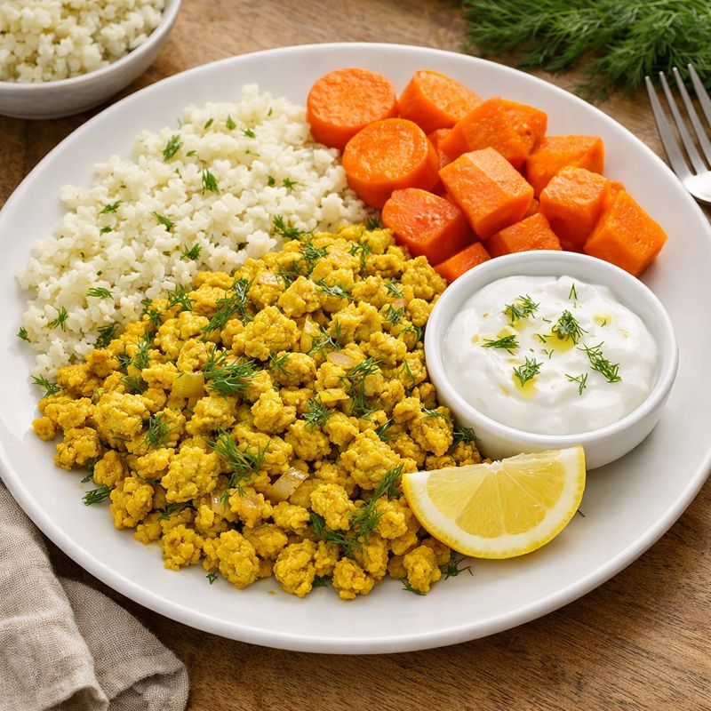

# 🟡 Antiinflammatorisk kycklingröra med blomkålsris

**AIP light • Keto / Low-carb • Vardagsmat & matlåda**

En enkel, saftig och antiinflammatorisk kycklingröra där **gurkmeja steks i fett först** för bättre upptag av kurkumin. Serveras med blomkålsris och kokta rotfrukter. Ingen sås behövs – men kokosyoghurt fungerar perfekt som valfritt tillbehör.

  

---

## 🛒 Ingredienser

### Kycklingröra
- 500 g kycklingfärs  
- 2 msk kokosolja eller olivolja  
- 1 liten gul lök, finhackad *(valfri men rekommenderad)*  
- 1 tsk gurkmeja  
- ½ tsk ingefära (pulver eller färsk), valfritt  
- 1–1½ tsk havssalt (smaka av)  
- 2–3 msk färsk dill, hackad  

### Till servering
- 300–400 g fryst blomkålsris  
- 3–4 morötter, skalade och grovt skurna  
- 1 liten sötpotatis, valfri (för AIP light)  
- Kokosyoghurt (1–2 msk per portion, valfritt)  
- Ev. lite citron till yoghurten  

---

## 👩‍🍳 Tillagning

### 1. Kycklingröra
1. Hetta upp fett i en stekpanna på **låg–medelvärme**.  
2. Tillsätt **gurkmeja** och låt fräsa **30–60 sekunder** (bränn inte).  
3. Lägg i lök och fräs mjuk.  
4. Tillsätt kycklingfärs och stek på medelvärme tills den är **smulig men fortfarande saftig**.  
5. Salta och tillsätt ev. ingefära.  
6. Ta av från värmen och vänd ner **dill**. Smaka av.

---

### 2. Blomkålsris
- Koka blomkålsriset i lättsaltat vatten **2–3 minuter**.  
- Häll av och låt ånga av **30–60 sekunder** så det inte blir vattnigt.  

*(Alternativ: ångkoka 3–4 minuter för torrare resultat.)*

---

### 3. Grönsaker
- Koka morötterna tills mjuka, ca **6–8 minuter**.  
- Koka sötpotatis separat om den används, ca **8–12 minuter** beroende på bitstorlek.

---

## 🍽 Servering
- Lägg upp blomkålsris som bas.  
- Toppa med kycklingröran.  
- Servera morötter och ev. sötpotatis vid sidan.  
- Ställ fram **kokosyoghurt** som valfritt tillbehör  
  *(gott med lite salt, citron och extra dill).*

---

## 🔑 Tips & variationer
- Stek inte färsen för hårt – lite glans = saftig rätt utan sås.  
- Gurkmeja fungerar bäst när den **värms i fett tidigt** i tillagningen.  
- För extra krämighet kan 1–2 msk kokosyoghurt röras ner i pannan på slutet.  
- Rätten håller **2–3 dagar i kyl** och passar utmärkt som matlåda.

---

## 🧠 Näringsmässig profil (översikt)
- Proteinrik  
- Låg kolhydratbelastning  
- Antiinflammatorisk (gurkmeja + fett)  
- Snäll för mage vid AIP light

---

*Receptet är anpassat för AIP light och keto/low-carb. Justera rotfrukter efter tolerans.*
